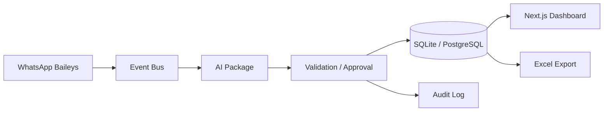

# Arquitetura — Finance AI Dashboard

**Versão:** 0.0.3

## Visão geral

Sistema event-driven para captura financeira via WhatsApp, processamento por IA, persistência em banco (fonte de verdade) e visualização/exportação via dashboard.

## Camadas

| Camada | Responsabilidade |
|--------|------------------|
| apps/dashboard | UI, Route Handlers, KPIs |
| packages/core | Domínios, Event Bus |
| packages/shared | Tipos, erros, utils, contratos técnicos |
| packages/database | Prisma, mappers, repositórios |
| packages/whatsapp | Provider desacoplado |
| packages/ai | Structured outputs, OCR |
| packages/excel | Exportação (derivada do DB) |
| packages/audit | Trilha de auditoria |

## Princípios

1. **Spec Driven Development** — spec antes de código
2. **Banco como fonte de verdade** — Excel é export
3. **Eventos para desacoplamento** — sem acoplamento direto entre módulos
4. **IA com schema Zod** — nunca texto livre
5. **Aprovação humana** — confidence < 0.80
6. **Soft delete** — Expense/Revenue nunca DELETE físico (ADR-004)

## Soft Delete Strategy

Expense e Revenue utilizam `deletedAt: Date | null`. Operações de remoção setam timestamp; queries padrão filtram `deletedAt IS NULL`. Ver [ADR-004](../adr/004-soft-delete.md).

## Portas e ambientes

- Dev: `http://localhost:4000`
- Docker: mapeamento `4000:4000`
- CI: GitHub Actions (ver [ci-cd.md](../deployment/ci-cd.md))

## Domínios

Cada domínio em `packages/core/src/domains/{name}/`:

- `application/` — casos de uso
- `domain/` — entidades e regras
- `infrastructure/` — adapters InMemory (testes) + Prisma em `@finance-ai/database`
- `tests/` — testes do domínio

## Eventos iniciais

- MessageReceived, ImageReceived
- ExpenseDetected, ExpenseApproved, ExpenseRejected
- ExcelGenerated

## KPIs (Dashboard)

- Total gastos mês, Total receitas mês, Lucro
- Quantidade de lançamentos
- Top categorias, Top fornecedores

## Roadmap

Ver [ROADMAP.md](../../ROADMAP.md) na raiz do repositório.
