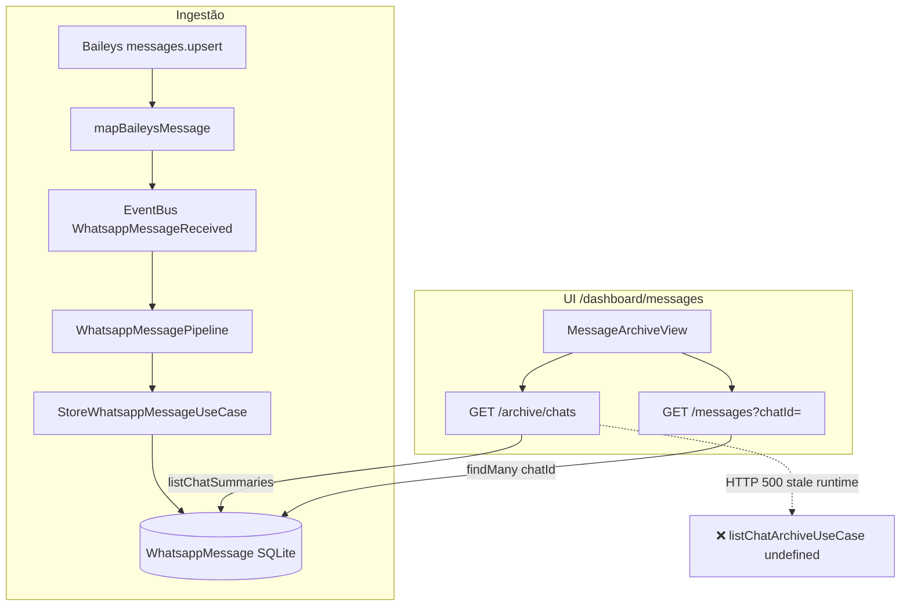

# RC-05 — Diagnóstico Message Archive UI vs Persistência

**Data:** 2025-06-25  
**Tipo:** Investigação apenas (sem correção)  
**Sintoma reportado:** UI `/dashboard/messages` possivelmente vazia ou desconectada dos dados persistidos

---

## Resumo executivo

| Pergunta | Resposta |
|----------|----------|
| Há mensagens no banco? | **Sim — 310 registros** em `WhatsappMessage` |
| Há chats distintos? | **Sim — 16 `chatId` distintos** |
| A UI lê a mesma tabela que o Baileys grava? | **Sim (por design)** — ambos usam `WhatsappMessage` via Prisma |
| Por que a UI pode aparecer vazia? | **`GET /api/whatsapp/archive/chats` retorna HTTP 500** no servidor em execução; a coluna esquerda depende exclusivamente dessa rota |
| Causa raiz provável do 500 | **Runtime WhatsApp singleton desatualizado** (processo `next dev` iniciado antes do RC-04) — `listChatArchiveUseCase` ausente no objeto global cacheado |

---

## 1. Evidências SQL / Prisma

**Banco canônico:** `packages/database/prisma/dev.db`  
**DATABASE_URL (dashboard):** `file:./packages/database/prisma/dev.db` → resolvido para `file:C:/Dev/Dashboard-UNIQUE/packages/database/prisma/dev.db`

Script executado: `packages/database/scripts/rc-05-diagnostic.ts`

### Queries equivalentes

```sql
SELECT COUNT(*) FROM WhatsappMessage;
-- Resultado: 310

SELECT COUNT(DISTINCT chatId) FROM WhatsappMessage;
-- Resultado: 16

SELECT messageType, COUNT(*) AS cnt
FROM WhatsappMessage
GROUP BY messageType
ORDER BY cnt DESC;
```

### Resultado agregado (Prisma)

```json
{
  "totalMessages": 310,
  "distinctChatIds": 16,
  "chatConfigRows": 17,
  "emptyTextMessages": 60,
  "byMessageType": [
    { "type": "IMAGE", "count": 130 },
    { "type": "TEXT", "count": 108 },
    { "type": "UNKNOWN", "count": 62 },
    { "type": "AUDIO", "count": 9 },
    { "type": "DOCUMENT", "count": 1 }
  ]
}
```

### Top chats por atividade

| chatId | Mensagens | Última atividade (UTC) |
|--------|-----------|------------------------|
| `553591215342-1607379398@g.us` | 193 | 2026-06-25T17:59:28.000Z |
| `158304038858972@lid` | 39 | 2026-06-25T17:48:20.000Z |
| `106506699694167@lid` | 9 | 2026-06-25T17:26:52.000Z |
| `182613503422668@lid` | 7 | 2026-06-25T16:37:01.000Z |
| … | … | … |

### Amostra — mensagem mais recente

```json
{
  "id": "0757120e-c7b9-4a58-b0ef-4d95ef536836",
  "chatId": "553591215342-1607379398@g.us",
  "sender": "14852013740151@lid",
  "senderId": "",
  "senderName": null,
  "chatName": null,
  "messageType": "IMAGE",
  "content": "",
  "fromMe": false,
  "hasRawPayload": true
}
```

**Observação de qualidade (não bloqueia listagem):** `senderId` vazio em registros pré/backfill RC-04; 60 mensagens `TEXT` com conteúdo vazio.

---

## 2. Evidências HTTP (servidor `localhost:4000` em execução)

### `GET /api/whatsapp/archive/chats`

```
HTTP 500
{"error":"Failed to list chat archive"}
```

### `GET /api/whatsapp/metrics`

```
HTTP 500
```

### `GET /api/whatsapp/messages?limit=5`

```json
{
  "items": [ /* 5 mensagens */ ],
  "total": 310,
  "page": 1,
  "limit": 5
}
```

**Nota:** resposta **sem** campos RC-04 (`senderId`, `senderName`, `chatName`, `fromMe`) — indica bundle do servidor **desatualizado** em relação ao código-fonte atual.

### `GET /api/whatsapp/messages?chatId=553591215342-1607379398@g.us&limit=3`

```json
{
  "items": [ /* 3 msgs do grupo — coincidentemente as mais recentes */ ],
  "total": 310,
  "page": 1,
  "limit": 3
}
```

**Evidência:** parâmetro `chatId` **ignorado** pelo servidor em execução (`total` deveria ser ~193, não 310). Código-fonte atual já passa `chatId` ao repositório — confirma processo stale.

---

## 3. Use case funciona fora do Next.js

Script: `packages/database/scripts/rc-05-archive-usecase.ts`

```
ListWhatsappChatArchiveUseCase.execute() → SUCCESS count=16
```

Primeiros 5 chats retornados (JSON real):

```json
[
  {
    "chatId": "553591215342-1607379398@g.us",
    "chatName": null,
    "messageCount": 193,
    "lastMessageAt": "2026-06-25T17:59:28.000Z",
    "lastMessagePreview": "",
    "lastMessageType": "IMAGE"
  },
  {
    "chatId": "143533612773523@lid",
    "chatName": null,
    "messageCount": 3,
    "lastMessageAt": "2026-06-25T17:55:53.000Z",
    "lastMessagePreview": "",
    "lastMessageType": "AUDIO"
  }
]
```

**Conclusão:** dados e query `listChatSummaries()` estão corretos; a falha é na **camada HTTP/runtime**, não no banco.

---

## 4. Fluxo completo — ingestão (Baileys)

```
BaileysWhatsappProvider.handleMessages()
  → mapBaileysMessage(raw)
  → recordMessageReceived()
  → handler(incoming)  [runtime.ts onMessage]
  → EventBus.publish(WhatsappMessageReceived)
  → WhatsappMessagePipeline.register()
      → EnsureWhatsappChatDiscoveredUseCase → WhatsappChatConfig (nome do chat)
      → StoreWhatsappMessageUseCase
          → WhatsappMessagePrismaRepository.save()
              → Tabela SQLite: WhatsappMessage
  → EventBus.publish(WhatsappMessagePersisted) → pipeline financeiro (legado)
```

**Entidade/tabela de ingestão:** `WhatsappMessage` (Prisma model)  
**Entidade auxiliar:** `WhatsappChatConfig` (metadados de chat, descoberta via `chats.upsert` / groups)

---

## 5. Fluxo completo — UI `/dashboard/messages`

Componente: `MessageArchiveView` (`apps/dashboard/src/components/messages/message-archive-view.tsx`)

| Passo | Endpoint | Use case | Tabela |
|-------|----------|----------|--------|
| Coluna esquerda (chats) | `GET /api/whatsapp/archive/chats` | `ListWhatsappChatArchiveUseCase` → `listChatSummaries()` | `WhatsappMessage` (+ join lógico `WhatsappChatConfig` para nome) |
| Coluna direita (mensagens) | `GET /api/whatsapp/messages?chatId=…&limit=200` | `ListWhatsappMessagesUseCase` → `findMany({ chatId })` | `WhatsappMessage` |

**A UI NÃO lê:** memória do Baileys, Event Bus, fila in-memory, nem `WhatsappChatConfig` diretamente para a lista de chats (usa agregação em `WhatsappMessage`).

---

## 6. Mesma fonte de dados?

| Caminho | Fonte |
|---------|-------|
| Baileys → persistência | `WhatsappMessage` |
| UI chats | `WhatsappMessage` (groupBy chatId) |
| UI mensagens | `WhatsappMessage` (filter chatId) |

**Sim — mesma tabela.** Não há divergência arquitetural de storage.

**Porém:** no servidor atual, a rota de chats **falha antes de ler o banco**, e a rota de mensagens **não filtra por chatId** (código stale). Efeito prático na UI:

1. `loadChats()` recebe 500 → `items: undefined` → lista vazia → *"Nenhum chat ainda"*
2. `selectedChatId` nunca é definido → painel direito não carrega conversa
3. Mesmo com restart, se `chatId` filter não aplicar, painel direito mostraria mensagens globais misturadas (bug secundário)

---

## 7. Causa raiz provável (RC-05)

### Primária — singleton `globalForWhatsapp.whatsappRuntime`

```typescript
// apps/dashboard/src/lib/whatsapp/runtime.ts
export function getWhatsappRuntime(): WhatsappRuntime {
  if (!globalForWhatsapp.whatsappRuntime) {
    globalForWhatsapp.whatsappRuntime = createRuntime()
  }
  return globalForWhatsapp.whatsappRuntime
}
```

RC-04 adicionou `listChatArchiveUseCase` e `metricsUseCase` em `createRuntime()`. Se o processo Next.js foi iniciado **antes** dessa alteração, o singleton cacheia o objeto antigo **sem** esses use cases.

Efeito em `archive/chats/route.ts`:

```typescript
const { listChatArchiveUseCase } = getWhatsappRuntime()
await listChatArchiveUseCase.execute() // TypeError: Cannot read properties of undefined
→ catch → HTTP 500
```

**Validação sugerida (manual, sem alterar código):** reiniciar `pnpm dev` e repetir `GET /api/whatsapp/archive/chats`. Se retornar 200 com 16 items, confirma hipótese.

### Secundária — qualidade dos dados (não explica UI vazia)

- `chatName` null em todos os chats testados (nome só em `WhatsappChatConfig.name` se descoberto)
- `lastMessagePreview` vazio quando última msg é IMAGE/AUDIO sem caption
- 60 TEXT vazios (dados históricos pré-RC-04)

---

## 8. Diagrama



---

## 9. Arquivos relevantes

| Papel | Path |
|-------|------|
| UI | `apps/dashboard/src/components/messages/message-archive-view.tsx` |
| API chats | `apps/dashboard/src/app/api/whatsapp/archive/chats/route.ts` |
| API messages | `apps/dashboard/src/app/api/whatsapp/messages/route.ts` |
| Runtime singleton | `apps/dashboard/src/lib/whatsapp/runtime.ts` |
| Repositório | `packages/database/src/repositories/whatsapp-message.prisma-repository.ts` |
| Pipeline ingest | `packages/whatsapp/src/pipeline/whatsapp-message.pipeline.ts` |
| Schema | `packages/database/prisma/schema.prisma` → models `WhatsappMessage`, `WhatsappChatConfig` |

---

## 10. Próximos passos (fora do escopo RC-05)

Não implementados nesta investigação. Candidatos para RC-05 fix:

1. Reinicializar ou invalidar `globalForWhatsapp.whatsappRuntime` em hot reload
2. Validar restart completo do dev server pós-RC-04
3. Backfill `senderId` onde `senderId = ''`
4. Confirmar filtro `chatId` após restart

---

## Scripts de reprodução

```bash
# Contagens no banco
cd packages/database && pnpm exec tsx scripts/rc-05-diagnostic.ts

# Use case isolado (deve retornar 16 chats)
cd packages/database && pnpm exec tsx scripts/rc-05-archive-usecase.ts

# APIs (com dev server rodando)
curl http://localhost:4000/api/whatsapp/archive/chats
curl "http://localhost:4000/api/whatsapp/messages?limit=5"
curl "http://localhost:4000/api/whatsapp/messages?chatId=553591215342-1607379398@g.us&limit=3"
```
