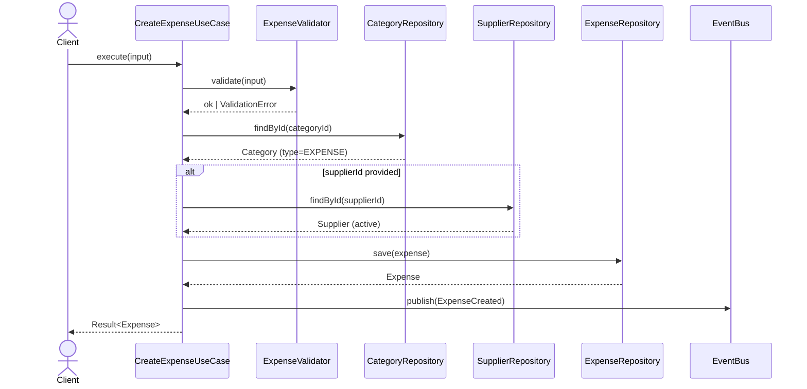
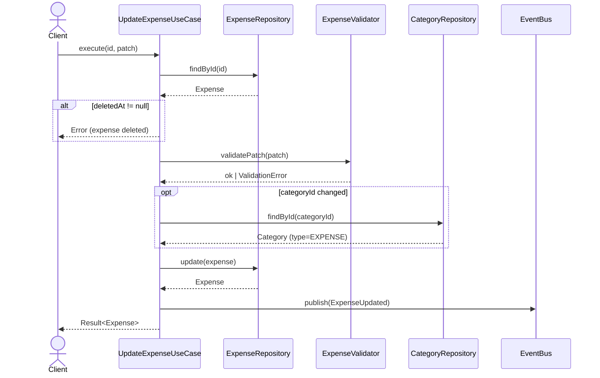
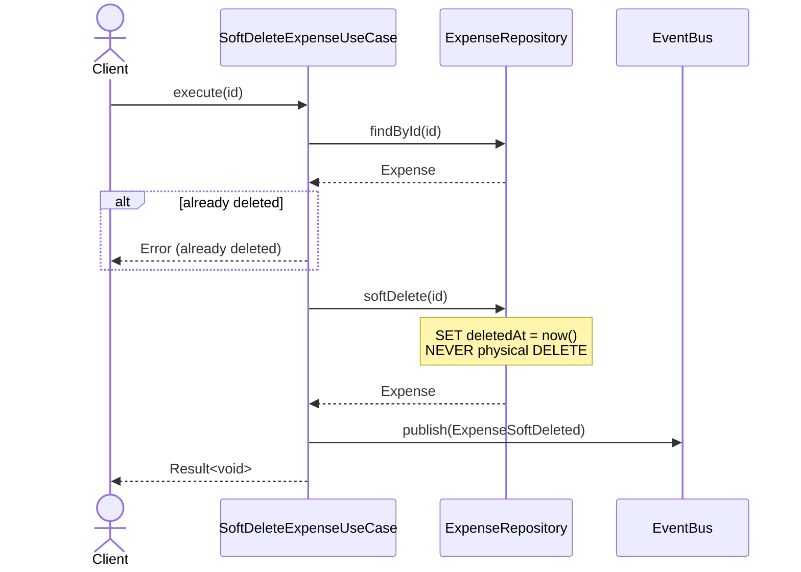
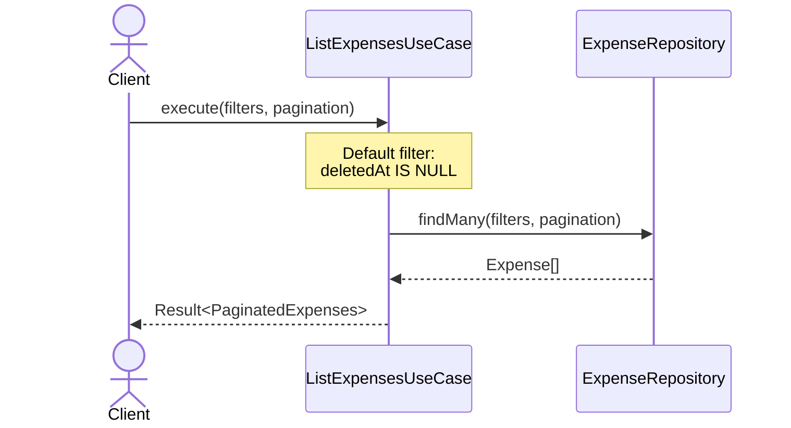

# Expense — Sequence Diagrams

Diagramas de sequência para casos de uso da entidade Expense (Epic 02).

---

## CreateExpense

---

## UpdateExpense

---

## SoftDeleteExpense

---

## ListExpenses

---

## Notas arquiteturais

- Repositórios são **interfaces** nesta spec; implementação Prisma na Epic 03
- Event Bus conforme ADR-002 (`InMemoryEventBus` no MVP)
- Soft delete conforme ADR-004 — repositório expõe `softDelete`, nunca `delete`
