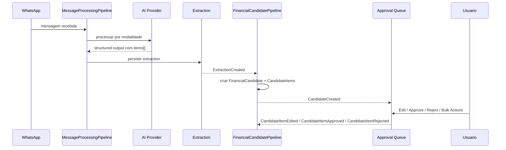

# Epic 08 — Financial Candidates + Approval Queue

**Status:** Em especificacao  
**Depende de:** Epic 04, Epic 05, Epic 06, RC-08, RC-10

## Objetivo

Transformar `Extraction` em candidatos financeiros auditaveis, editaveis e aprovaveis, sem criar `Expense` ou `Revenue` nesta epic.

Fluxo obrigatorio:

```text
WhatsApp
-> Pipeline
-> IA
-> Extraction
-> Financial Candidate
-> Approval Queue
-> (aguarda usuario)
```

## Escopo

- Criar o dominio `financial-candidate`
- Criar o agregado/lista `candidate-item` com suporte multi-item
- Criar `approval-queue` e `approval-decision`
- Definir APIs, eventos e UI para `/dashboard/approvals`
- Atualizar contrato da IA para sempre retornar `items[]`
- Suportar `TEXT`, `IMAGE`, `DOCUMENT` e `AUDIO`
- Registrar auditoria de aprovacao/rejeicao com comentario opcional
- Suportar aprovacao por item, aprovacao em massa e edicao antes da aprovacao
- Restringir categorias sugeridas a categorias existentes
- Preparar handoff seguro para pos-aprovacao, soft delete e futura entidade `Adjustment`

## Fora de escopo

- Nao criar `Expense` ou `Revenue`
- Criacao de `Expense`
- Criacao de `Revenue`
- Mutacoes financeiras definitivas
- Regras novas do dominio financeiro existente
- Automatizacao de resposta no WhatsApp
- OCR/provedores externos alem do necessario para especificar compatibilidade

## Entregaveis da spec

- `financial-candidate/README.md`
- `candidate-item/README.md`
- `approval-queue/README.md`
- `test-matrix.md` com minimo de 60 casos
- `events-catalog.md`
- `adr-impact.md`
- Harnesses da Epic 08

## Dominios e responsabilidades

| Dominio | Responsabilidade |
|---|---|
| `FinancialCandidate` | Envelope auditavel derivado de uma `Extraction`, podendo conter itens de despesa e receita simultaneamente |
| `CandidateItem` | Itens financeiros individuais detectados pela IA, cada um com tipo, confianca e estado de aprovacao proprios |
| `ApprovalDecision` | Registro imutavel de aprovacao/rejeicao por usuario, individual ou em massa |
| `ApprovalQueue` | Visao/listagem/acoes pendentes para operador, com edicao previa e selecao em lote |

## Requisitos funcionais

1. Uma `Extraction` pode gerar 1..N `CandidateItem`s.
2. A IA deve retornar `items[]` em todas as modalidades.
3. Cada item precisa conter `description`, `amount`, `category`, `supplier`, `date`, `confidence`, `reasoning` e `itemType (EXPENSE|REVENUE)`.
4. O candidato pai deve ter `candidateType` agregado (`EXPENSE`, `REVENUE` ou `MIXED`), `status`, `confidence` agregado e `reasoning` consolidado.
5. A aprovacao e rejeicao ocorrem por `CandidateItem`, com operacoes de massa derivadas (`Approve All`, `Reject All`, `Approve Selected`, `Reject Selected`).
6. Cada item pode ser editado completamente antes da aprovacao, com auditoria das alteracoes.
7. Nenhum lancamento financeiro definitivo pode ser criado antes da Epic 09.
8. Todo ato de aprovacao/rejeicao e toda edicao previa a aprovacao precisa registrar `userId`, `timestamp` e `comment` opcional.
9. `/dashboard/approvals` deve mostrar origem, mensagem original, arquivo original, tipo, confianca e itens detectados.
10. Categorias sugeridas pela IA devem ser limitadas a categorias existentes no banco.
11. Todo item aprovado deve manter referencia para `WhatsappMessage`, `Extraction` e arquivo original quando houver.
12. O desenho da epic deve preparar o pos-aprovacao: editar lancamento, estornar lancamento, nunca excluir fisicamente.
13. Banco permanece fonte unica de verdade; Excel continua apenas como projecao/exportacao derivada.

## Requisitos nao funcionais

- Compatibilidade total com Epics 01-07
- Event-driven, sem acoplamento direto UI -> dominio financeiro
- Forte tipagem e trilha de auditoria
- Persistencia preparada para SQLite MVP e futura migracao PostgreSQL
- Sem dependencia de autenticacao externa nesta fase (proxy local sem auth)
- Compatibilidade explicita com ADR-004 (Soft Delete)
- Preparacao explicita para futura entidade `Adjustment`

## Eventos obrigatorios

- `CandidateCreated`
- `CandidateUpdated`
- `CandidateApproved`
- `CandidateRejected`
- `CandidateItemApproved`
- `CandidateItemRejected`
- `CandidateItemEdited`
- `CandidateBulkApproved`
- `CandidateBulkRejected`

## Dependencias tecnicas

- `WhatsappMessage` (Epic 04)
- `MessageProcessingPipeline` (Epic 05)
- `Extraction` (Epic 06)
- `WhatsappChatConfig` / governanca de chat (RC-08)
- Structured outputs com schema valido OpenAI (RC-10)

## Criterios de aceite da epic

### CA-08-01 — multi-item texto misto
- **Given** uma mensagem `"16 reais bala, 20 reais cheirinho"`
- **When** a IA retorna dois itens validos em `items[]`
- **Then** um `FinancialCandidate` com 2 `CandidateItem`s e criado e fica `PENDING` na approval queue

### CA-08-02 — aprovacao por item sem lancamento
- **Given** um candidato `PENDING` com 2 itens
- **When** um usuario aprova apenas 1 item com comentario opcional
- **Then** o item muda para `APPROVED`, auditoria e registrada e nenhum `Expense`/`Revenue` e criado nesta epic

### CA-08-03 — rejeicao auditavel por item
- **Given** um candidato `PENDING`
- **When** um usuario rejeita 1 item
- **Then** o item muda para `REJECTED`, `ApprovalDecision` e persistida e o evento de rejeicao correspondente e emitido

### CA-08-04 — imagem/documento/audio
- **Given** uma `Extraction` originada de `IMAGE`, `DOCUMENT` ou `AUDIO`
- **When** o payload estruturado retorna `items[]`
- **Then** o fluxo de criacao de candidato deve ser identico ao de `TEXT`

### CA-08-05 — aprovacao em massa
- **Given** um candidato `PENDING` com 3 itens
- **When** o usuario usa `Approve All`
- **Then** todos os itens sao aprovados, auditoria em massa e registrada e o candidato agregado reflete conclusao total

### CA-08-06 — edicao antes da aprovacao
- **Given** um item pendente com categoria ou valor sugerido incorreto
- **When** o usuario edita o item antes de aprovar
- **Then** a alteracao fica auditada e a aprovacao posterior usa os valores editados

### CA-08-07 — candidato misto
- **Given** uma mensagem que gera itens de despesa e receita ao mesmo tempo
- **When** a extraction retorna `items[]` com ambos os tipos
- **Then** um unico `FinancialCandidate` agregado `MIXED` deve conter todos os itens

## Sequencia alvo



## Proibido nesta epic

- Criar `Expense` ou `Revenue`
- Mover logica de aprovacao para fora do dominio/core
- Ignorar auditoria de decisao
- Quebrar o contrato atual de `Extraction` antes de introduzir adaptador/migracao compatível

## Compatibilidade com ADR-004 (Soft Delete)

- Nenhum lancamento definitivo e criado nesta epic, mas todo desenho pos-aprovacao deve assumir `deletedAt` e nunca exclusao fisica.
- Aprovar um item nesta epic nao remove sua origem (`WhatsappMessage`, `Extraction`, arquivo) nem seu historico de decisao.
- A futura Epic 09 deve respeitar soft delete para `Expense` e `Revenue`.

## Preparacao para pos-aprovacao

- Item aprovado deve manter trilha para futura edicao de lancamento.
- Item aprovado deve prever futuro estorno sem exclusao fisica.
- A futura entidade `Adjustment` deve poder referenciar o item aprovado e/ou o lancamento materializado.
- Banco continua como unica fonte de verdade; Excel permanece projecao/exportacao derivada.

## Proximo passo

Epic 09 ativa a conversao de `FinancialCandidate APPROVED` em `Expense` ou `Revenue` usando o dominio financeiro existente.
