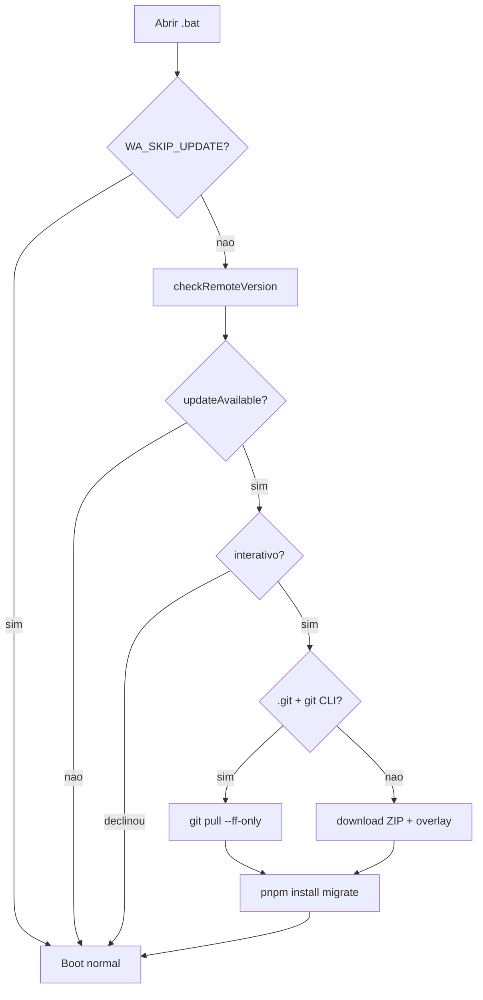

# RC-18B — Auto-update completo no launcher (Git + ZIP)

**Versão alvo:** 1.6.1-rc18b  
**Status:** implementado

## Objetivo

Atualização automática ao abrir `Start WhatsApp Assistant.bat` para instalações Git **e** ZIP (sem `.git`), preservando `storage/`, banco SQLite, `.env` e demais dados do usuário.

## Escopo

| In | Out |
|----|-----|
| `packages/shared/src/update/` — tipos, URLs GitHub, paths protegidos | Tauri / instalador `.exe` |
| `scripts/update/` — orquestrador, git, zip overlay, rollback | Hot-swap com servidor Next rodando |
| Integração `launch.mjs` + logs `logs/update.log` | Assinatura criptográfica do ZIP (v2) |
| Dashboard: banner, Sobre, `check-for-updates` | `git clone` na primeira instalação |
| `storage/.update-state.json` | Canais beta/stable (campo preparado) |

## Fluxo

## Paths protegidos (SSOT)

Ver `packages/shared/src/update/protected-paths.ts` — nunca sobrescritos no overlay.

## Variáveis de ambiente

| Variável | Efeito |
|----------|--------|
| `WA_SKIP_UPDATE=1` | Pula checagem |
| `WA_UPDATE_SILENT=1` | Atualiza sem prompt |
| `WA_UPDATE_AUTO=1` | Assume sim no prompt |
| `WA_UPDATE_FORCE=1` | Re-download mesmo na mesma versão |
| `WA_BRANCH=develop` | Override branch Git |

## Critérios de aceite

Ver README seção "Como atualizar" e harness `harness/rc-18b/index.ts`.

## Referências

- ADR-017 (RC-18 parcial Git)
- ADR-021 (RC-18B dual-channel)
- Investigação: `docs/investigations/2026-06-30-zip-user-no-auto-update.md`
